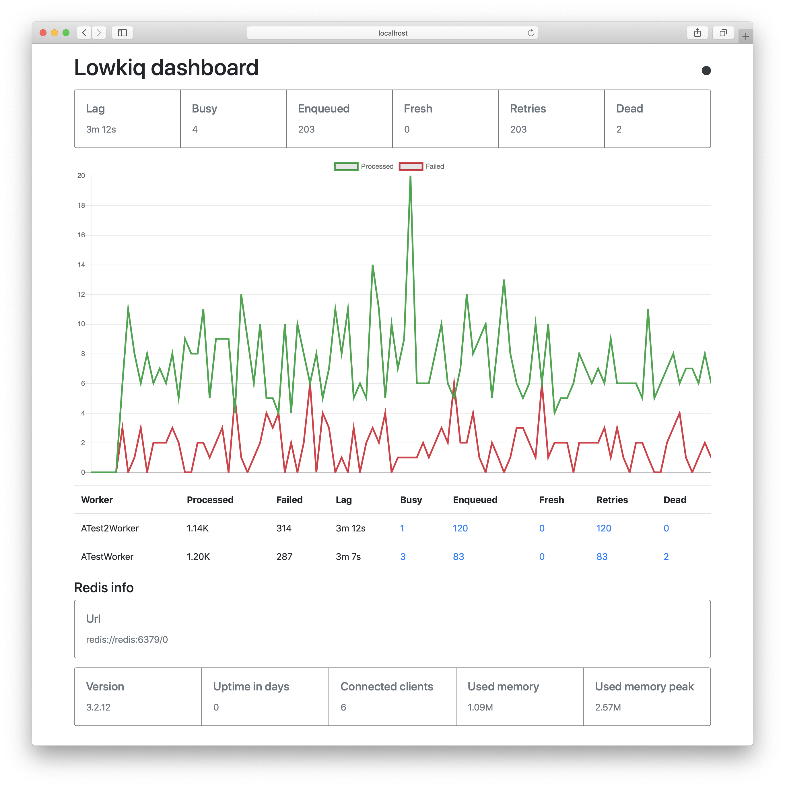

[](https://badge.fury.io/rb/lowkiq)

# Lowkiq

Упорядоченная обработка фоновых задач.



* [Rationale](#rationale)
* [Description](#description)
* [Sidekiq](#sidekiq)
* [Очередь](#%D0%BE%D1%87%D0%B5%D1%80%D0%B5%D0%B4%D1%8C)
  + [Алгоритм расчета retry_count и perform_in](#%D0%B0%D0%BB%D0%B3%D0%BE%D1%80%D0%B8%D1%82%D0%BC-%D1%80%D0%B0%D1%81%D1%87%D0%B5%D1%82%D0%B0-retry_count-%D0%B8-perform_in)
  + [Правило слияния задач](#%D0%BF%D1%80%D0%B0%D0%B2%D0%B8%D0%BB%D0%BE-%D1%81%D0%BB%D0%B8%D1%8F%D0%BD%D0%B8%D1%8F-%D0%B7%D0%B0%D0%B4%D0%B0%D1%87)
* [Install](#install)
* [Api](#api)
* [Ring app](#ring-app)
* [Настройка](#%D0%BD%D0%B0%D1%81%D1%82%D1%80%D0%BE%D0%B9%D0%BA%D0%B0)
* [Запуск](#%D0%B7%D0%B0%D0%BF%D1%83%D1%81%D0%BA)
* [Остановка](#%D0%BE%D1%81%D1%82%D0%B0%D0%BD%D0%BE%D0%B2%D0%BA%D0%B0)
* [Debug](#debug)
* [Development](#development)
* [Исключения](#%D0%B8%D1%81%D0%BA%D0%BB%D1%8E%D1%87%D0%B5%D0%BD%D0%B8%D1%8F)
* [Rails integration](#rails-integration)
* [Splitter](#splitter)
* [Scheduler](#scheduler)
* [Рекомендации по настройке](#%D1%80%D0%B5%D0%BA%D0%BE%D0%BC%D0%B5%D0%BD%D0%B4%D0%B0%D1%86%D0%B8%D0%B8-%D0%BF%D0%BE-%D0%BD%D0%B0%D1%81%D1%82%D1%80%D0%BE%D0%B9%D0%BA%D0%B5)
  + [`SomeWorker.shards_count`](#someworkershards_count)
  + [`SomeWorker.max_retry_count`](#someworkermax_retry_count)
* [Изменение количества шардов воркера](#%D0%B8%D0%B7%D0%BC%D0%B5%D0%BD%D0%B5%D0%BD%D0%B8%D0%B5-%D0%BA%D0%BE%D0%BB%D0%B8%D1%87%D0%B5%D1%81%D1%82%D0%B2%D0%B0-%D1%88%D0%B0%D1%80%D0%B4%D0%BE%D0%B2-%D0%B2%D0%BE%D1%80%D0%BA%D0%B5%D1%80%D0%B0)

## Rationale

При использовании Sidekiq мы столкнулись с проблемами при обработке сообщений от сторонней системы.

Скажем, сообщение представляет собой данные заказа в определенный момент времени.
При изменении атрибутов или статуса отправляется новое сообщение сторонней системой.
Заказы обновляются часто и в очереди рядом находятся сообщения, касающиеся одного и того же заказа.

Sidekiq не гарантирует строгого порядка сообщений, т.к. очередь обрабатывается в несколько потоков.
Например, пришло 2 сообщения: M1 и M2.
Sidekiq обработчики начинают обрабатывать их параллельно,
при этом M2 может обработаться раньше M1.

Параллельная обработка данных одного заказа приводит к:

+ dead locks
+ затиранию новых данных старыми

Lowkiq призван устранить эти проблемы, исключая параллельность обработки сообщений в рамках одной сущности.

## Description

Очереди надежны. Lowkiq сохраняет данные об обрабатываемой задаче и при запуске переносит
незавершенные задачи обратно в очередь.

Задачи в очереди отсортированы по заданному времени исполнения, т.е. это не FIFO очереди.

Каждая задача имеет идентификатор. Очереди гарантируют, что не может быть ситуации,
когда несколько потоков обрабатывают задачи с одинаковыми идентификаторами.

Каждая очередь разбивается на постоянный набор шардов.
На основе идентификатора задачи выбирается шард, в который попадет задача.
Таким образом задачи с одним идентификатором всегда попадают в один и тот же шард.
Задачи шарда всегда обрабатываются одним и тем же потоком.
Это гарантирует порядок обработки задач с одинаковым идентификатором и исключает возможность блокировок.

Кроме идентификатора задача имеет полезную нагрузку или данные задачи (payload).
Для задач с одинаковым идентификаторм происходит слияние полезных нагрузок.
Таким образом одновременно в обработку попадают все накопленные полезные нагрузки задачи.
Это полезно, если нужно обработать только последнее сообщение и отбросить все предыдущие.

Каждой очереди соответствует воркер, содержащий логику обработки задачи.

Для обработки всех задач всех очередей используется фиксированное количество тредов.
Добавление или удаление очередей или их шардов не приводит к изменению числа тредов.

## Sidekiq

Если для ваших задач подходит Sidekiq - используйте его.

Если вы используете плагины вроде
[sidekiq-grouping](https://github.com/gzigzigzeo/sidekiq-grouping),
[sidekiq-unique-jobs](https://github.com/mhenrixon/sidekiq-unique-jobs),
[sidekiq-merger](https://github.com/dtaniwaki/sidekiq-merger)
или реализуете собственный механизм блокировок, то стоит рассмотреть Lowkiq.

Например, sidekiq-grouping предварительно накапливает пачку задач, ставит ее в очередь и начинает накапливать следующую.
При таком подходе случается ситуация, когда в очереди находятся 2 пачки с данными одного заказа.
Эти пачки начинают обрабатываться одновременно разными тредами, что приводит к изначальной проблеме.

Lowkiq изначально проектировался так, чтобы не использовать любые блокировки.

Кроме того, в Lowkiq очереди изначально надежны. Только Sidekiq Pro или плагины добавляют такую функциональность.

Этот [бенчмарк](examples/benchmark) показывает накладные расходы на взаимодействие с redis.
Для 5 threads, 100_000 blank jobs получились результаты:

+ lowkiq: 214 sec или 2,14 мс на задачу
+ sidekiq: 29 sec или 0.29 мс на задачу

Эта разница связана с принципиально различным устройством очередей.
Sidekiq использует один список для всех воркеров и извлекает задачу целиком за O(1).
Lowkiq использует несколько типов данных, включая сортированные множества для хранения идентификаторов задач.
Таким образом только получение идентификатора задачи занимает O(log(N)).

## Очередь

Каждая задача в очереди имеет аттрибуты:

+ `id` - идентификатор задачи (строка)
+ `payloads` - сортированное множество payload'ов (объекты) по их score (вещественное число)
+ `perform_in` - запланированное время начала иполнения задачи (unix timestamp, вещественное число)
+ `retry_count` - количество совершённых повторов задачи (вещественное число)

`id` может быть, например, идентификатором реплицируемой сущности
`payloads` - множество,
получаемое в результате группировки полезной нагрузки задачи по `id` и отсортированное по ее `score`.
`payload` может быть ruby объектом, т.к. сериализуется с помощью `Marshal.dump`.
`score` может быть датой (unix timestamp) создания `payload`
или ее монотонно увеличивающимся номером версии.
По умолчанию - текущий unix timestamp.
По умолчанию `perform_in` - текущий unix timestamp.
`retry_count` для новой необработанной задачи равен `-1`, для упавшей один раз - `0`,
т.е. считаются не совершённые, а запланированные повторы.

Выполнение задачи может закончиться неудачей.
В этом случае ее `retry_count` инкрементируется и по заданной формуле вычисляется новый `perform_in`,
и она ставится обратно в очередь.

В случае, когда `retry_count` становится `>=` `max_retry_count`
элемент payloads с наименьшим(старейшим) score перемещается в морг,
а оставшиеся элементы помещаются обратно в очередь, при этом
`retry_count` и `perform_in` сбрасываются в `-1` и `now()` соответственно.

### Алгоритм расчета retry_count и perform_in

0. задача выполнилась и упала
1. `retry_count++`
2. `perform_in = now + retry_in(try_count)`
3. `if retry_count >= max_retry_count` задача перемещается в морг

| тип         | `retry_count` | `perform_in` |
| ---         | ---           | ---          |
| новая не выполнялась | -1 | задан или `now()` |
| новая упала | 0 | `now() + retry_in(0)` |
| повтор упал | 1 | `now() + retry_in(1)` |

Если `max_retry_count = 1`, то попытки прекращаются.

### Правило слияния задач

Когда применяется:

+ если в очереди была задача и добавляется еще одна с тем же id
+ если при обработке возникла ошибка, а в очередь успели добавили задачу с тем же id
+ если задачу из морга поставили в очередь, а в очереди уже есть задача с тем же id

Алгоритм:

+ payloads объединяются, при этом выбирается минимальный score,
  т.е. для одинаковых payload выигрывает самая старая
+ если объединяется новая и задача из очереди,
  то `perform_in` и `retry_count` берутся из задачи из очереди
+ если объединяется упавшая задача и задача из очереди,
  то `perform_in` и `retry_count` берутся из упавшей
+ если объединяется задача из морга и задача из очереди,
  то `perform_in = now()`, `retry_count = -1`

Пример:

```
# v1 - первая версия, v2 - вторая
# #{"v1": 1} - сортированное множество одного элемента, payload - "v1", score - 1

# задача в очереди
{ id: "1", payloads: #{"v1": 1, "v2": 2}, retry_count: 0, perform_in: 1536323288 }
# добавляемая задача
{ id: "1", payloads: #{"v2": 3, "v3": 4}, retry_count: -1, perform_in: 1536323290 }

# результат
{ id: "1", payloads: #{"v1": 1, "v2": 3, "v3": 4}, retry_count: 0, perform_in: 1536323288 }
```

Морг - часть очереди. Задачи в морге не обрабатываются.
Задача в морге имеет следующие атрибуты:

+ id - идентификатор задачи
+ payloads - список

Задачи в морге можно отсортировать по дате изменения или id.

Задачу из морга можно переместить в очередь. При этом для нее `retry_count = 0`, `perform_in = now()`.

## Install

```
# Gemfile

gem 'lowkiq'
```

Redis версии >= 3.2.

## Api

```ruby
module ATestWorker
  extend Lowkiq::Worker

  self.shards_count = 24
  self.batch_size = 10
  self.max_retry_count = 5

  def self.retry_in(count)
    10 * (count + 1) # (i.e. 10, 20, 30, 40, 50)
  end

  def self.perform(payloads_by_id)
    # payloads_by_id - хеш
    payloads_by_id.each do |id, payloads|
      # id - идентификатор задачи
      # payloads отсортированы по score, от старых к новым (от минимальных к максимальным)
      payloads.each do |payload|
        do_some_work(id, payload)
      end
    end
  end
end
```

Значения по умолчанию:

```ruby
self.shards_count = 5
self.batch_size = 1
self.max_retry_count = 25
self.queue_name = self.name

# i.e. 15, 16, 31, 96, 271, ... seconds + a random amount of time
def retry_in(retry_count)
  (retry_count ** 4) + 15 + (rand(30) * (retry_count + 1))
end
```

```ruby
ATestWorker.perform_async [
  { id: 0 },
  { id: 1, payload: { attr: 'v1' } },
  { id: 2, payload: { attr: 'v1' }, score: Time.now.to_i, perform_in: Time.now.to_i },
]
# payload по умолчанию равен ""
# score и perform_in по умолчанию равны Time.now.to_i
```

Вы можете переопределить `perform_async` и вычислять `id`, `score` и `perform_in` в воркере:

```ruby
module ATestWorker
  extend Lowkiq::Worker

  def self.perform_async(jobs)
    jobs.each do |job|
      job.merge! id: job[:payload][:id]
    end
    super
  end

  def self.perform(payloads_by_id)
    #...
  end
end

ATestWorker.perform_async 1000.times.map { |id| { payload: {id: id} } }
```

## Ring app

`Lowkiq::Web` - ring app.

+ `/` - dashboard
+ `/api/v1/stats` - длина очереди, длина морга, лаг для каждого воркера и суммарно

## Настройка

Опции и значения по умолчанию:

+ `Lowkiq.poll_interval = 1` - задержка в секундах между опросами очереди на предмет новых задач.
  Используется только если на предыдущей итерации очередь оказалась пуста или случилась ошибка.
+ `Lowkiq.threads_per_node = 5` - кол-во тредов для каждой ноды.
+ `Lowkiq.redis = ->() { Redis.new url: ENV.fetch('REDIS_URL') }` - настройка redis.
+ `Lowkiq.client_pool_size = 5` - размер пула редиса для постановки задач в очередь.
+ `Lowkiq.pool_timeout = 5` - таймаут клиентского и серверного пула редиса
+ `Lowkiq.server_middlewares = []` - список middleware, оборачивающих воркер.
+ `Lowkiq.on_server_init = ->() {}` - выполнения кода при инициализации сервера.
+ `Lowkiq.build_scheduler = ->() { Lowkiq.build_lag_scheduler }` - планировщик.
+ `Lowkiq.build_splitter = ->() { Lowkiq.build_default_splitter }` - сплиттер.
+ `Lowkiq.last_words = ->(ex) {}` - обработчик исключений, потомков `StandardError`, вызвавших остановку процесса.

```ruby
$logger = Logger.new(STDOUT)

Lowkiq.server_middlewares << -> (worker, batch, &block) do
  $logger.info "Started job for #{worker} #{batch}"
  block.call
  $logger.info "Finished job for #{worker} #{batch}"
end

Lowkiq.server_middlewares << -> (worker, batch, &block) do
  begin
    block.call
  rescue => e
    $logger.error "#{e.message} #{worker} #{batch}"
    raise e
  end
end
```

## Запуск

`lowkiq -r ./path_to_app`

`path_to_app.rb` должен загрузить приложение. [Пример](examples/dummy/lib/app.rb).

Ленивая загрузка модулей воркеров недопустима.
Используйте для предварительной загрузки модулей
`require` или [`require_dependency`](https://api.rubyonrails.org/classes/ActiveSupport/Dependencies/Loadable.html#method-i-require_dependency)
для Ruby on Rails.

## Остановка

Послать процессу TERM или INT (Ctrl-C).
Процесс будет ждать завершения всех задач.

Обратите внимание, если очередь пуста, процесс спит `poll_interval` секунд.
Таким образом завершится не позднее чем через  `poll_interval` секунд.

## Debug

Получить trace всех тредов приложения:

```
kill -TTIN <pid>
cat /tmp/lowkiq_ttin.txt
```

## Development

```
docker-compose run --rm --service-port app bash
bundler
rspec
cd examples/dummy ; bundle exec ../../exe/lowkiq -r ./lib/app.rb
```

## Исключения

`StandardError` выброшенные воркером обрабатываются с помощью middleware.
Такие исключения не приводят к остановке процесса.

Все прочие исключения приводят к остановке процесса.
При этом Lowkiq дожидается выполнения задач другими тредами.

`StandardError` выброшенные вне воркера передаются в `Lowkiq.last_words`.
Например это происходит при потере соединения к Redis или при ошибке в коде Lowkiq.

## Rails integration

```ruby
# config/routes.rb

Rails.application.routes.draw do
 # ...
 mount Lowkiq::Web => '/lowkiq'
 # ...
end
```

```ruby
# config/initializers/lowkiq.rb

# загружаем все lowkiq воркеры
Dir["#{Rails.root}/app/lowkiq_workers/**/*.rb"].each { |file| require_dependency file }

# конфигурация:
# Lowkiq.redis = -> { Redis.new url: ENV.fetch('LOWKIQ_REDIS_URL') }
# Lowkiq.threads_per_node = ENV.fetch('LOWKIQ_THREADS_PER_NODE').to_i
# Lowkiq.client_pool_size = ENV.fetch('LOWKIQ_CLIENT_POOL_SIZE').to_i
# ...

Lowkiq.server_middlewares << -> (worker, batch, &block) do
  logger = Rails.logger
  tag = "#{worker}-#{Thread.current.object_id}"

  logger.tagged(tag) do
    time_start = Time.now
    logger.info "#{time_start} Started job, batch: #{batch}"
    begin
      block.call
    rescue => e
      logger.error e.message
      raise e
    ensure
      time_end = Time.now
      logger.info "#{time_end} Finished job, duration: #{time_end - time_start} sec"
    end
  end
end

# Sentry integration
Lowkiq.server_middlewares << -> (worker, batch, &block) do
  opts = {
    extra: {
      lowkiq: {
        worker: worker.name,
        batch: batch,
      }
    }
  }

  Raven.capture opts do
    block.call
  end
end

# NewRelic integration
if defined? NewRelic
  class NewRelicLowkiqMiddleware
    include NewRelic::Agent::Instrumentation::ControllerInstrumentation

    def call(worker, batch, &block)
      opts = {
        category: 'OtherTransaction/LowkiqJob',
        class_name: worker.name,
        name: :perform,
      }

      perform_action_with_newrelic_trace opts do
        block.call
      end
    end
  end

  Lowkiq.server_middlewares << NewRelicLowkiqMiddleware.new
end

# Rails reloader, в том числе отвечает за высвобождение ActiveRecord коннектов
Lowkiq.server_middlewares << -> (worker, batch, &block) do
  Rails.application.reloader.wrap do
    block.call
  end
end

Lowkiq.on_server_init = ->() do
  [[ActiveRecord::Base, ActiveRecord::Base.configurations[Rails.env]]].each do |(klass, init_config)|
    klass.connection_pool.disconnect!
    config = init_config.merge 'pool' => Lowkiq.threads_per_node
    klass.establish_connection(config)
  end
end
```

Запуск: `bundle exec lowkiq -r ./config/environment.rb`

## Splitter

У каждого воркера есть несколько шардов:

```
# worker: shard ids
worker A: 0, 1, 2
worker B: 0, 1, 2, 3
worker C: 0
worker D: 0, 1
```

Lowkiq использует фиксированное кол-во тредов для обработки задач, следовательно нужно распределить шарды
между тредами. Этим занимается Splitter.

Чтобы определить набор шардов, которые будет обрабатывать тред, поместим их в один список:

```
A0, A1, A2, B0, B1, B2, B3, C0, D0, D1
```

Рассмотрим Default splitter, который равномерно распределяет шарды по тредам единственной ноды.

Если `threads_per_node` установлено в 3, то распределение будет таким:

```
# thread id: shards
t0: A0, B0, B3, D1
t1: A1, B1, C0
t2: A2, B2, D0
```

Помимо Default есть ByNode splitter. Он позволяет распределить нагрузку по нескольким процессам (нодам).

```
Lowkiq.build_splitter = -> () do
  Lowkiq.build_by_node_splitter(
    ENV.fetch('LOWKIQ_NUMBER_OF_NODES').to_i,
    ENV.fetch('LOWKIQ_NODE_NUMBER').to_i
  )
end
```

Таким образом, вместо одного процесса нужно запустить несколько и указать переменные окружения:

```
# process 0
LOWKIQ_NUMBER_OF_NODES=2 LOWKIQ_NODE_NUMBER=0 bundle exec lowkiq -r ./lib/app.rb

# process 1
LOWKIQ_NUMBER_OF_NODES=2 LOWKIQ_NODE_NUMBER=1 bundle exec lowkiq -r ./lib/app.rb
```

Отмечу, что общее количество тредов будет равно произведению `ENV.fetch('LOWKIQ_NUMBER_OF_NODES')` и  `Lowkiq.threads_per_node`.

Вы можете написать свой сплиттер, если ваше приложение требует особого распределения шардов между тредами или нодами.

## Scheduler

Каждый тред обрабатывает набор шардов. За выбор шарда для обработки отвечает планировщик.
Каждый поток имеет свой собственный экземпляр планировщика.

Lowkiq имеет 2 планировщика на выбор.
Первый, `Seq` - последовательно перебирает шарды.
Второй, `Lag` - выбирает шард с самой старой задачей, т.е. стремится минимизировать лаг.
Используется по умолчанию.

Планировщик задается через настройки:

```
Lowkiq.build_scheduler = ->() { Lowkiq.build_seq_scheduler }
# или
Lowkiq.build_scheduler = ->() { Lowkiq.build_lag_scheduler }
```

## Рекомендации по настройке

### `SomeWorker.shards_count`

Сумма `shards_count` всех воркеров не должна быть меньше `Lowkiq.threads_per_node`
иначе треды будут простаивать.

Сумма `shards_count` всех воркеров может быть равна `Lowkiq.threads_per_node`.
В этом случае тред обрабатывает единственный шард. Это имеет смысл только при равномерной нагрузке на очереди.

Сумма `shards_count` всех воркеров может быть больше `Lowkiq.threads_per_node`.
В этом случае `shards_count` можно рассматривать в качестве приоритета.
Чем он выше, тем чаще задачи этой очереди будут обрабатываться.

Нет смысла устанавливать `shards_count` одного воркера больше чем `Lowkiq.threads_per_node`,
т.к. каждый тред будет обрабатывать более одного шарда этой очереди, что увеличит накладные расходы.

### `SomeWorker.max_retry_count`

Исходя из `retry_in` и `max_retry_count`,
можно вычислить примерное время, которая задача проведет в очереди.
Под задачей тут понимается payload задачи.
После достижения `max_retry_count` в морг переносится только payload с минимальным score.

Для `retry_in`, заданного по умолчанию получается следующая таблица:

```ruby
def retry_in(retry_count)
  (retry_count ** 4) + 15 + (rand(30) * (retry_count + 1))
end
```

| `max_retry_count` | кол-во дней жизни задачи |
| --- | --- |
| 14 | 1 |
| 16 | 2 |
| 18 | 3 |
| 19 | 5 |
| 20 | 6 |
| 21 | 8 |
| 22 | 10 |
| 23 | 13 |
| 24 | 16 |
| 25 | 20 |

`(0...25).map{ |c| retry_in c }.sum / 60 / 60 / 24`


## Изменение количества шардов воркера

Старайтесь сразу расчитать количество шардов и не именять их количество в будущем.

Если вы можете отключить добавление новых заданий,
то дождитесь опустошения очередей и выкатите новую версию кода с измененным количеством шардов.

Если такой возможности нет, воспользуйтесь следующим сценарием.

Например, есть воркер:

```ruby
module ATestWorker
  extend Lowkiq::Worker

  self.shards_count = 5

  def self.perform(payloads_by_id)
    some_code
  end
end
```

Теперь нужно указать новое кол-во шардов и задать новое имя очереди:

```ruby
module ATestWorker
  extend Lowkiq::Worker

  self.shards_count = 10
  self.queue_name = "#{self.name}_V2"

  def self.perform(payloads_by_id)
    some_code
  end
end
```

И добавить воркер, перекладывающий задачи из старой очереди в новую:

```ruby
module ATestMigrationWorker
  extend Lowkiq::Worker

  self.shards_count = 5
  self.queue_name = "ATestWorker"

  def self.perform(payloads_by_id)
    jobs = payloads_by_id.each_with_object([]) do |(id, payloads), acc|
      payloads.each do |payload|
        acc << { id: id, payload: payload }
      end
    end

    ATestWorker.perform_async jobs
  end
end
```
